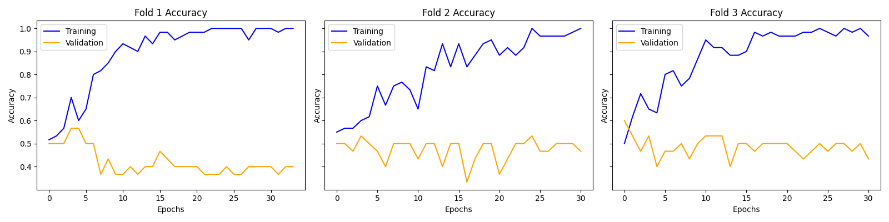
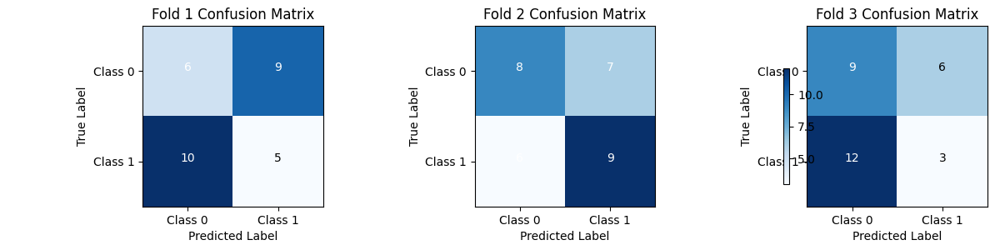
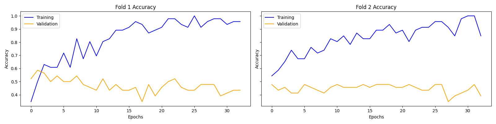
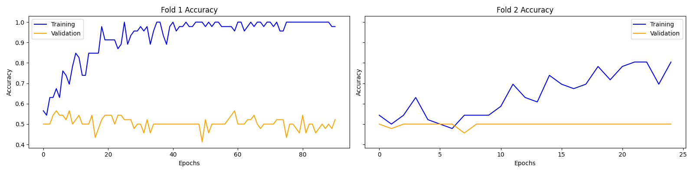
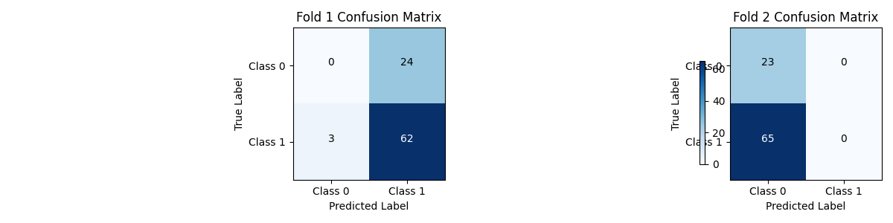
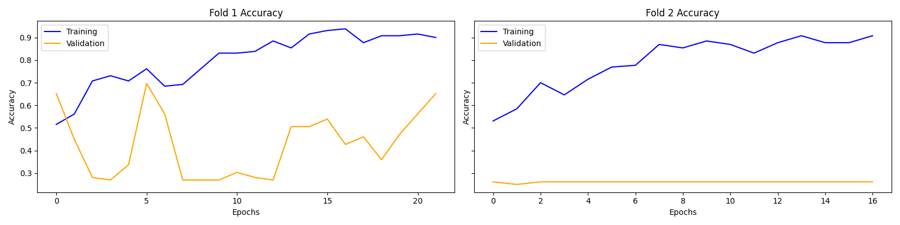
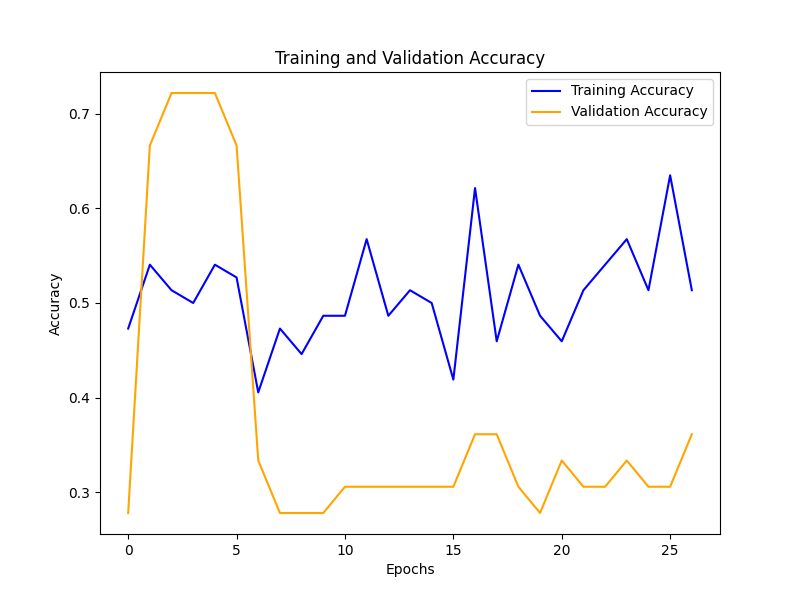
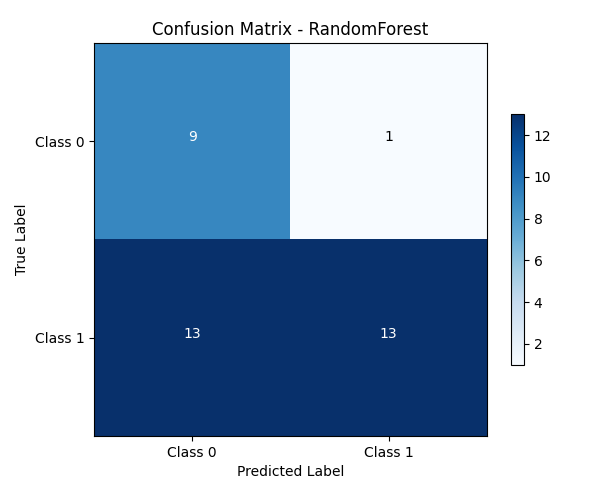
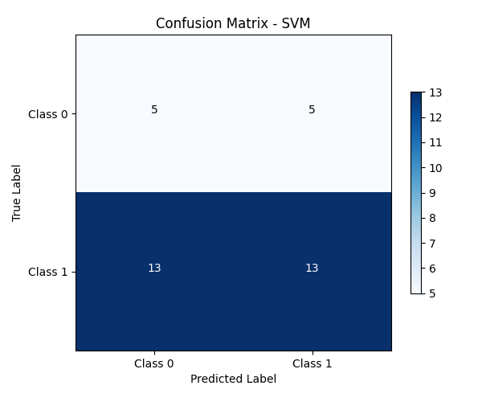
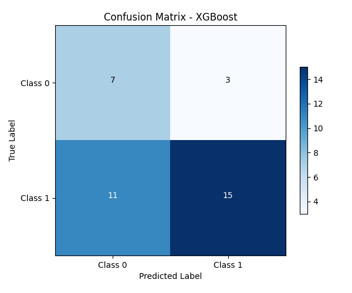

# ECG_HF
高频心电信号分类尝试  

## 文件管理

目前每次训练的模型架构和模型都放在results

数据量其实比较小，只有177条，但是质量应该还可以，可以多试试。
其中ecg_cnn部分为心律失常代码，判断分为5级，不能直接迁移学习，但可以学习其模型架构  
先用普通的cnn进行尝试  

## 调参心路

从目前的结果看  
在 epoch 1 后，验证集 accuracy 立即达到 72.22%，但随后同一值培训进入长达 18 轮的直线阶段，显示验证效果已经均衡且无进一步提升。

同时，训练 accuracy 由最初 60.3%一路升至 85.1%，而 loss 持续下降，显示模型正在迟缓地学习近似分类器，但这种学习在验证集无法体现，即表示学习的是训练集中的专有特征，有过学识的倾向。

同时，验证 loss 在 epoch 11 后体现最低值 0.6926 ，随后越来越高，较乎突出地表示一定程度上已经进入过拟合阶段。

test accuracy = val accuracy = 72.22%，表明分组设置并无显著 data leakage，但模型效果地址别性已经形成瓶颈。

### 数据分配

尽管验证集结果稳定，但根据数据量不大，建议重新分割数据或实时采用 K 折交叉验证（K=5或10），可大幅清除模型表现不稳定的偏差。  
本思想是将数据集分成K个子集或“折”（folds），然后进行K次训练和验证，每次选择其中一个不同的折作为验证集，其余的K-1个折合并起来作为训练集。将原始数据集随机分成K个大小大致相等的互斥子集。理想情况下，这些子集应该保持原始数据集的分布特性，特别是对于分类任务时，每个子集中的类别比例应与整个数据集一致，这被称为分层抽样。

当数据量非常小的时候，可能会使用留一法（Leave-One-Out, LOO），即K等于数据集中的样本数

### 优化算法

现有模型 loss 减少速度不错，但验证 loss 进入明显的升高阶段，建议：

将lr下降率从 1e-3 调低至 1e-4，或带入 ReduceLROnPlateau 自动调整lr下降  

### 发现华点
我们的数据并不均衡

因此数据中的类别分布，应该作为模型训练的重要参考。

需要在划分训练集和测试集的时候，对数据集进行重新划分，以平衡数据集。

解决方案，添加类别权重

尝试了，但是效果并没有变好，同时还引入了几个新指标，但没有那么好

### 需要调整训练集等的划分逻辑

画了混淆矩阵，明显没学习到特征

按类别分组：将样本按标签分组，获取每个类别的索引列表。

平衡采样：对每个类别进行欠采样（针对多数类）或过采样（针对少数类），使每个类别可用样本数一致。

固定数量划分：通过自定义 K 折划分，确保每个折中每个类别的样本数相同（如每折包含n个正样本和n个负样本）。

### 不是数据集划分问题
现在的模型将所有结果都预测为1，这明显是有问题的

#### 增加初始卷积层的特征图数量（filters=16→32），提升特征提取能力。
有一点提升，但不多

初始卷积层特征图数量从2→16（增强特征提取）
    x = layers.Conv1D(filters=16, kernel_size=hp.Kt, padding='causal', use_bias=False)(inputs)
    x = layers.BatchNormalization()(x)

learning_rate = 1e-4

self.patience_lr = 10  # 学习率降低耐心值

改为3折，提升数据量

self.factor_lr = 0.8  # 学习率降低因子

self.patience_es = 8  # 早停耐心值
self.patience_lr = 10  # 学习率降低耐心值

这两个参数需要好好调一调

self.patience_es = 20  # 早停耐心值
self.patience_lr = 8  # 学习率降低耐心值

**有效改善了！！！**

### 我的训练集的效果在逐步提升趋于100%，但是验证集没有起色  
当训练集效果趋近于 100% 但验证集性能停滞时，说明模型出现了过拟合（Overfitting）

#### 方法一：降低模型复杂度

x = layers.Conv1D(filters=16, kernel_size=hp.Kt, padding='causal', use_bias=False)(inputs)
x = layers.Conv1D(filters=8, kernel_size=hp.Kt, padding='causal', use_bias=False)(inputs)
——没用

self.Kt = 16  # TCN卷积核大小

**有效一些，混淆矩阵好很多了**

#### 方法二：切换为2折，提升数据数量

  

仍然是老问题，训练中训练集虽然在提升，但是验证集没有提升，反复波动

#### 方法三：数据预处理与分布一致性优化
问题分析：
当前数据归一化采用每个样本单独归一化（ecg_data / np.max(np.abs(ecg_data))），导致训练集与验证集的特征分布不一致（各样本尺度独立），可能引发验证集波动。
优化方案：
使用全局归一化（基于训练集的统计量归一化所有数据），确保训练 / 验证集分布一致。

没有改善，撤回

#### 增强正则化与缓解过拟合
问题分析：
当前 Dropout 比例为0.3，正则化强度不足；
模型可能因复杂度较高（多层 TCN）在小数据集上过拟合。
优化方案：
增大 Dropout 比例至0.4-0.5；
添加 L2 正则化到卷积层；
尝试更小的模型复杂度（如减少滤波器数量Ft）。
  

## 换模型lstm了

还是一样的问题……

## 通过传统ML方法进行数据集好坏验证

综上，采用了3种机器学习方法，通过网格优化保证参数不影响结果，但是仍然阳性分不出来，最需要改进的还是数据预处理部分，还需要提升数据量

## 优化数据集，看看效果如何

现在可以尝试的预处理工作  
1 学习文章里的思路，对数据先滤波100hz以下，100hz以上全部保留，再做叠加  
2 仍然按照之前的逻辑，但是时间窗合并保留不要合成一个，每个人随机选窗口合成100个  
