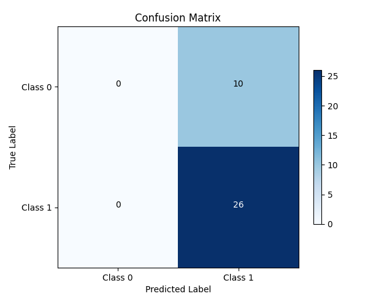

# ECG_HF
高频心电信号分类尝试  

## 文件管理

目前每次训练的模型架构和模型都放在results

数据量其实比较小，只有177条，但是质量应该还可以，可以多试试。
其中ecg_cnn部分为心律失常代码，判断分为5级，不能直接迁移学习，但可以学习其模型架构  
先用普通的cnn进行尝试  

## 调参心路

从目前的结果看  
在 epoch 1 后，验证集 accuracy 立即达到 72.22%，但随后同一值培训进入长达 18 轮的直线阶段，显示验证效果已经均衡且无进一步提升。

同时，训练 accuracy 由最初 60.3%一路升至 85.1%，而 loss 持续下降，显示模型正在迟缓地学习近似分类器，但这种学习在验证集无法体现，即表示学习的是训练集中的专有特征，有过学识的倾向。

同时，验证 loss 在 epoch 11 后体现最低值 0.6926 ，随后越来越高，较乎突出地表示一定程度上已经进入过拟合阶段。

test accuracy = val accuracy = 72.22%，表明分组设置并无显著 data leakage，但模型效果地址别性已经形成瓶颈。

### 数据分配

尽管验证集结果稳定，但根据数据量不大，建议重新分割数据或实时采用 K 折交叉验证（K=5或10），可大幅清除模型表现不稳定的偏差。  
本思想是将数据集分成K个子集或“折”（folds），然后进行K次训练和验证，每次选择其中一个不同的折作为验证集，其余的K-1个折合并起来作为训练集。将原始数据集随机分成K个大小大致相等的互斥子集。理想情况下，这些子集应该保持原始数据集的分布特性，特别是对于分类任务时，每个子集中的类别比例应与整个数据集一致，这被称为分层抽样。

当数据量非常小的时候，可能会使用留一法（Leave-One-Out, LOO），即K等于数据集中的样本数

### 优化算法

现有模型 loss 减少速度不错，但验证 loss 进入明显的升高阶段，建议：

将lr下降率从 1e-3 调低至 1e-4，或带入 ReduceLROnPlateau 自动调整lr下降  

### 发现华点
我们的数据并不均衡

因此数据中的类别分布，应该作为模型训练的重要参考。

需要在划分训练集和测试集的时候，对数据集进行重新划分，以平衡数据集。

解决方案，添加类别权重

尝试了，但是效果并没有变好，同时还引入了几个新指标，但没有那么好

### 需要调整训练集等的划分逻辑

画了混淆矩阵，明显没学习到特征

按类别分组：将样本按标签分组，获取每个类别的索引列表。

平衡采样：对每个类别进行欠采样（针对多数类）或过采样（针对少数类），使每个类别可用样本数一致。

固定数量划分：通过自定义 K 折划分，确保每个折中每个类别的样本数相同（如每折包含n个正样本和n个负样本）。


### 不是数据集划分问题
现在的模型将所有结果都预测为1，这明显是有问题的

#### 增加初始卷积层的特征图数量（filters=16→32），提升特征提取能力。
有一点提升，但不多

初始卷积层特征图数量从2→16（增强特征提取）
    x = layers.Conv1D(filters=16, kernel_size=hp.Kt, padding='causal', use_bias=False)(inputs)
    x = layers.BatchNormalization()(x)

learning_rate = 1e-4

self.patience_lr = 10  # 学习率降低耐心值

改为3折，提升数据量

self.factor_lr = 0.8  # 学习率降低因子

self.patience_es = 8  # 早停耐心值
self.patience_lr = 10  # 学习率降低耐心值

这两个参数需要好好调一调

self.patience_es = 20  # 早停耐心值
self.patience_lr = 8  # 学习率降低耐心值

**有效改善了！！！**


### 我的训练集的效果在逐步提升趋于100%，但是验证集没有起色  
当训练集效果趋近于 100% 但验证集性能停滞时，说明模型出现了过拟合（Overfitting）

#### 方法一：降低模型复杂度

x = layers.Conv1D(filters=16, kernel_size=hp.Kt, padding='causal', use_bias=False)(inputs)
x = layers.Conv1D(filters=8, kernel_size=hp.Kt, padding='causal', use_bias=False)(inputs)
——没用

self.Kt = 16  # TCN卷积核大小


**有效一些，混淆矩阵好很多了**


#### 方法二：切换为2折，提升数据数量

  

仍然是老问题，训练中训练集虽然在提升，但是验证集没有提升，反复波动

#### 方法三：数据预处理与分布一致性优化
问题分析：
当前数据归一化采用每个样本单独归一化（ecg_data / np.max(np.abs(ecg_data))），导致训练集与验证集的特征分布不一致（各样本尺度独立），可能引发验证集波动。
优化方案：
使用全局归一化（基于训练集的统计量归一化所有数据），确保训练 / 验证集分布一致。


没有改善，撤回

#### 增强正则化与缓解过拟合
问题分析：
当前 Dropout 比例为0.3，正则化强度不足；
模型可能因复杂度较高（多层 TCN）在小数据集上过拟合。
优化方案：
增大 Dropout 比例至0.4-0.5；
添加 L2 正则化到卷积层；
尝试更小的模型复杂度（如减少滤波器数量Ft）。
  


## 换模型lstm了

还是一样的问题……



## 通过传统ML方法进行数据集好坏验证


综上，采用了3种机器学习方法，通过网格优化保证参数不影响结果，但是仍然阳性分不出来，最需要改进的还是数据预处理部分，还需要提升数据量


## 优化数据集，看看效果如何

现在可以尝试的预处理工作  
1 学习文章里的思路，对数据先滤波100hz以下，100hz以上全部保留，再做叠加  
2 仍然按照之前的逻辑，但是时间窗合并保留不要合成一个，每个人随机选窗口合成100个  

### CNN再验证

目前使用的模型架构是：  
Total params: 46,177  
Trainable params: 45,729  
Non-trainable params: 448  
这样的模型结构优点在于： 分层特征提取架构：滤波器数量递增（32→64→128）：模拟人脑从简单到复杂的特征识别过程  
初始层（kernel_size=5）捕捉QRS波群等宏观特征  
深层（kernel_size=3）识别细微的ST段变化和高频噪声模式  
符合ECG信号的多尺度特性（宏观波形+微观震荡）  
针对高频ECG的高采样率（通常250-1000Hz）进行2倍降采样，保留关键波形特征同时减少计算量，增强对时间偏移的鲁棒性（如R波位置微小变化） 
 layers.GlobalAveragePooling1D()替代传统的Flatten层，避免参数爆炸，保持通道维度信息（128维特征向量），特别适合处理长序列ECG数据

噪声抑制能力：卷积层天然过滤肌电噪声（50-60Hz） Dropout层抑制电极接触噪声  批标准化补偿基线漂移  


Data shape: (16950, 400, 12)  
Labels shape: (16950,)

在当前的数据量下，模型效果有显著改善，上升更为平缓，同时验证集上终于有了一些提升，再次验证了数据量对于模型效果的重要性。

可以看到验证集部分其实loss和acc都有较大波动，但是整体上在上升，说明模型在验证集上表现良好。


但现在的CNN还是在收敛中表现得不太平稳，而且训练进程上看，其实还有很大的优化空间。

#### 做简单的调参，优化当前表现

提升batchsize到128，训练轮数到128

训练效率提升明显，深度快得多，然而验证集的波动仍然存在，而且准确率有下降，表现出难以继续收敛


进一步优化参数，将epochs增加到256，batchsize增加到256
    early_stopping = EarlyStopping(monitor='val_loss', patience=10, restore_best_weights=True)
    reduce_lr = ReduceLROnPlateau(monitor='val_loss', factor=0.8, patience=5, min_lr=1e-6)

  
  
表现一般，应该不是batchsize 的问题，考虑其他参数  

ReduceLROnPlateau(patience=10)：当 val_loss 连续 10 轮不下降时降学习率，而EarlyStopping(patience=20)：连续 20 轮不下降时停止。  
学习率衰减后模型仍未恢复，需要更多轮数观察，建议EarlyStopping.patience为ReduceLROnPlateau.patience的 1.5-2 倍（如patience=15和patience=30）。

**结论：** 还是小batch的效果会好一些，就32已经足够，现在看来，就是初见即巅峰了


#### 小改无用，最后尝试一下修改优化器，看看效果
optimizer=tf.keras.optimizers.Adam(learning_rate=1e-4) ————→  
optimizer=tf.keras.optimizers.Adam(learning_rate=0.001)  

先大步搜索，再稳步寻找


### 问题发现！数据集本身的分析

ECG 数据具有强个体特异性（不同患者的心跳形态差异大），即使使用stratify=y划分训练 / 验证集，仍可能存在以下问题导致验证集分布局部波动：  

患者样本的 **跨集污染**  
train_test_split按样本随机划分，但 ECG 数据通常以 “患者” 为单位采集（同一患者可能有多个心跳样本）。若同一患者的样本被同时分到训练集和验证集，会导致：  
验证集中包含与训练集高度相似的样本（同一患者的心跳），模型可能 “记住” 该患者特征，导致验证 acc 在该患者样本出现时异常升高，下一轮未出现时下降。  

**改用患者级分层划分（Patient-wise Split）**，确保同一患者的所有样本仅出现在训练集或验证集中，避免跨集污染。

patient_ids = np.array([os.path.basename(f).split('_beat_')[0] for f in all_files])  # 需根据实际文件名调整

```
按患者分组划分（训练集70%患者，验证集30%患者）
gss = GroupShuffleSplit(n_splits=1, test_size=0.3, random_state=88)
train_idx, val_idx = next(gss.split(X, y, groups=patient_ids))
X_train, X_test = X[train_idx], X[val_idx]
y_train, y_test = y[train_idx], y[val_idx]
```


#### 调整数据集划分后，引入类别权重

同时还扩大了batchsize，效果不错

结果很烂


#### 需要大改模型了

```
def build_lead_wise_model(input_shape):
    # 输入形状：(时序长度, 12导联)
    inputs = layers.Input(shape=input_shape)
    
    # -------------------- 导联独立特征提取分支 --------------------
    # 拆分12个导联（每个导联形状：(时序长度, 1)）
    lead_branches = []
    for i in range(12):
        # 提取第i个导联（保留通道维度）
        lead = layers.Lambda(lambda x: x[..., i:i+1])(inputs)
        
        # 导联独立的特征提取（参数共享：所有导联使用同一组卷积核）
        x = layers.Conv1D(32, kernel_size=5, padding='same')(lead)  # 仅处理当前导联的时序
        x = layers.BatchNormalization()(x)
        x = layers.ReLU()(x)
        x = layers.Dropout(0.2)(x)
        
        x = layers.Conv1D(64, kernel_size=5, padding='same')(x)
        x = layers.BatchNormalization()(x)
        x = layers.ReLU()(x)
        x = layers.MaxPooling1D(pool_size=2)(x)  # 时序长度减半
        
        x = layers.Conv1D(128, kernel_size=3, padding='same')(x)
        x = layers.BatchNormalization()(x)
        x = layers.ReLU()(x)
        x = layers.GlobalAveragePooling1D()(x)  # 每个导联输出128维特征
        
        lead_branches.append(x)
    
    # -------------------- 导联特征融合 --------------------
    # 拼接12个导联的特征向量（总维度：12×128=1536）
    merged_features = layers.Concatenate()(lead_branches)
    
    # -------------------- 分类头 --------------------
    x = layers.Dense(256, activation='relu')(merged_features)  # 融合后增加非线性变换
    x = layers.Dropout(0.3)(x)
    outputs = layers.Dense(1, activation='sigmoid')(x)  # 二分类输出
    
    # 模型编译
    model = models.Model(inputs=inputs, outputs=outputs)
    model.compile(
        optimizer=tf.keras.optimizers.Adam(learning_rate=0.001),
        loss='binary_crossentropy',
        metrics=['accuracy']
    )
    return model
```

我看了数据的具体情况

现在的模型架构改了一下，从每个通道单独提取特征，最后合并，而不是一起输入，提取特征

因为导联之间其实是正交的，几个导联之间的形态特征不可能有效
